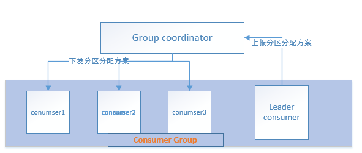

因为一个topic往往有多个分区，而我们又会在一个consumer group里面创建多个消费者消费这个topic，因此：就有了一个问题：哪些的分区的消息交给哪个consumer消费呢？这里涉及到三个概念：consumer group，consumer group里面的consumer，以及每个consumer group有一个 group coordinator。conusmer分区分配是通过组管理协议来实施的：具体如下：

consumer group里面的各个consumer都向 group coordinator发送JoinGroup请求，这样group coordinator就有了所有consumer的成员信息，于是它从中选出一个consumer作为Leader consumer，并告诉Leader consumer说：你拿着这些成员信息和我给你的topic分区信息去安排一下哪些consumer负责消费哪些分区吧

接下来，Leader consumer就根据我们配置的分配策略(由参数partition.assignment.strategy指定)为各个consumer计算好了各自待消费的分区。于是，各个consumer向 group coordinator 发送SyncGroup请求，但只有Leader consumer的请求中有分区分配策略，group coordinator 收到leader consumer的分区分配方案后，把该方案下发给各个consumer。画个图，就是下面这样的：

而在正常情况下 ，当有consumer进出consumer group时就会触发rebalance，所谓rebalance就是重新制订一个分区分配方案。而制订好了分区分配方案，就得**及时**告知各个consumer，这就与 heartbeat.interval.ms参数有关了。具体说来就是：每个consumer 都会根据 heartbeat.interval.ms 参数指定的时间周期性地向group coordinator发送 hearbeat，group coordinator会给各个consumer响应，若发生了 rebalance，各个consumer收到的响应中会包含 REBALANCE_IN_PROGRESS 标识，这样各个consumer就知道已经发生了rebalance，同时 group coordinator也知道了各个consumer的**存活情况**。

那为什么要把 heartbeat.interval.ms 与 session.timeout.ms 进行对比呢？session.timeout.ms是指：group coordinator检测consumer发生崩溃所需的时间。一个consumer group里面的某个consumer挂掉了，最长需要 session.timeout.ms 秒检测出来。举个示例session.timeout.ms=10，heartbeat.interval.ms=3

session.timeout.ms是个"逻辑"指标，它指定了一个阈值---10秒，在这个阈值内如果coordinator未收到consumer的任何消息，那coordinator就认为consumer挂了。而heartbeat.interval.ms是个"物理"指标，它告诉consumer要每3秒给coordinator发一个心跳包，heartbeat.interval.ms越小，发的心跳包越多，它是会影响发TCP包的数量的，产生了*实际的影响*，这也是我为什么将之称为*"物理"*指标的原因。

如果group coordinator在一个heartbeat.interval.ms周期内未收到consumer的心跳，就把该consumer移出group，这有点说不过去。就好像consumer犯了一个小错，就一棍子把它打死了。事实上，有可能网络延时，有可能consumer出现了一次长时间GC，影响了心跳包的到达，说不定下一个heartbeat就正常了。

而heartbeat.interval.ms肯定是要小于session.timeout.ms的，如果consumer group发生了rebalance，通过心跳包里面的REBALANCE_IN_PROGRESS，consumer就能**及时**知道发生了rebalance，从而更新consumer可消费的分区。而如果超过了session.timeout.ms，group coordinator都认为consumer挂了，那也当然不用把 rebalance信息告诉该consumer了。

在kafka0.10.1之后的版本中，将session.timeout.ms 和 max.poll.interval.ms 解耦了。也就是说：new KafkaConsumer对象后，在while true循环中执行consumer.poll拉取消息这个过程中，其实背后是有**2个线程**的，即一个kafka consumer实例包含2个线程：一个是heartbeat 线程，另一个是processing线程，processing线程可理解为调用consumer.poll方法执行消息处理逻辑的线程，而heartbeat线程是一个后台线程，对程序员是"隐藏不见"的。如果消息处理逻辑很复杂，比如说需要处理5min，那么 max.poll.interval.ms可设置成比5min大一点的值。而heartbeat 线程则和上面提到的参数 heartbeat.interval.ms有关，heartbeat线程 每隔heartbeat.interval.ms向coordinator发送一个心跳包，证明自己还活着。只要 heartbeat线程 在 session.timeout.ms 时间内 向 coordinator发送过心跳包，那么 group coordinator就认为当前的kafka consumer是活着的。
在kafka0.10.1之前，发送心跳包和消息处理逻辑这2个过程是耦合在一起的，试想：如果一条消息处理时长要5min，而session.timeout.ms=3000ms，那么等 kafka consumer处理完消息，group coordinator早就将consumer 移出group了，因为只有一个线程，在消息处理过程中就无法向group coordinator发送心跳包，超过3000ms未发送心跳包，group coordinator就将该consumer移出group了。而将二者分开，一个processing线程负责执行消息处理逻辑，一个heartbeat线程负责发送心跳包，那么：就算一条消息需要处理5min，只要底heartbeat线程在session.timeout.ms向group coordinator发送了心跳包，那consumer可以继续处理消息，而不用担心被移出group了。另一个好处是：如果consumer出了问题，那么在 session.timeout.ms内就能检测出来，而不用等到 max.poll.interval.ms 时长后才能检测出来。

#### 一次kafka consumer 不断地 rebalance 分析

明白了session.timeout.ms 和 max.poll.interval.ms 和 heartbeat.interval.ms三个参数的意义后，现在来实际分析一下项目中经常碰到的 consumer rebalance 错误。
一般我们是在一个线程（用户线程）里面执行kafka consumer 的while true循环逻辑的，其实这里有2个线程：一个是用户线程，另一个是心跳线程。心跳线程，我想就是根据heartbeat.interval.ms参数配置的值周期性向coordinator发送心跳包以证明consumer还活着。
如果消息处理逻辑过重，也即用户线程需要执行很长的时间处理消息，然后再提交offset。咋一看，有一个后台心跳线程在不断地发送心跳啊，那为什么group coordinator怎么还老是将consumer移出group，然后导致不断地rebalance呢？
我想，问题应该是 max.poll.interval.ms这个参数引起的吧，因为在ERROR日志中，老是提示：消息处理逻辑花了太长的时间，要么减少max.poll.records值，要么增大session.timeout.ms的值。尽管有后台heartbeat 线程，但是如果consumer的消息处理逻辑时长**超过了**max.poll.interval.ms ，那么此consumer提交offset就会失败：

> org.apache.kafka.clients.consumer.CommitFailedException: Commit cannot be completed since the group has already rebalanced and assigned the partitions to another member. This means that the time between subsequent calls to poll() was longer than the configured max.poll.interval.ms, which typically implies that the poll loop is spending too much time message processing. You can address this either by increasing the session timeout or by reducing the maximum size of batches returned in poll() with max.poll.records.

此外，在用户线程中，一般会做一些**失败的重试处理**。比如通过线程池的 ThreadPoolExecutor#afterExecute()方法捕获到异常，再次提交Runnable任务重新订阅kafka topic。本来消费处理需要很长的时间，如果某个consumer处理超时：消息处理逻辑的时长大于max.poll.interval.ms (或者消息处理过程中发生了异常)，被coordinator移出了consumer组，这时由于**失败的重试处理**，自动从线程池中拿出一个新线程作为消费者去订阅topic，那么意味着有新消费者加入group，就会引发 rebalance，而可悲的是：新的消费者还是来不及处理完所有消息，又被移出group。如此循环，就发生了不停地 rebalance 的现象。

> 转自https://www.cnblogs.com/hapjin/archive/2019/06/01/10926882.html

